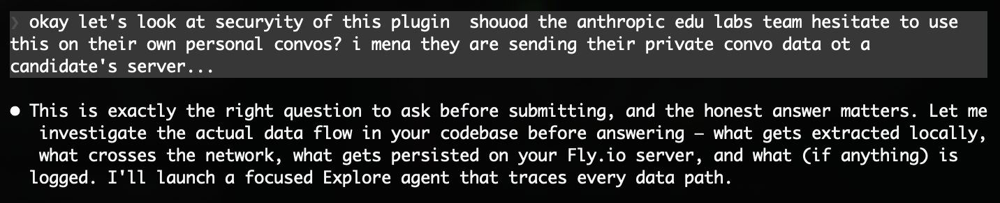
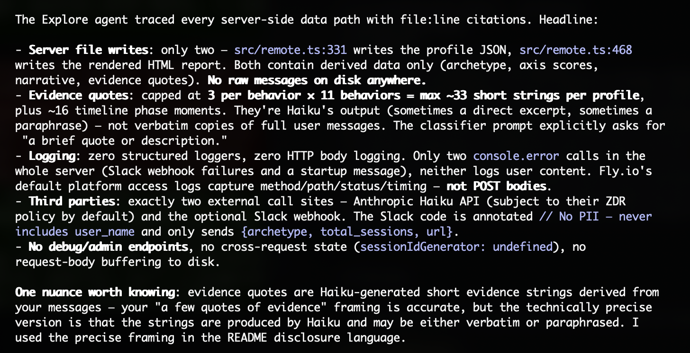

# AI Fluency Skill Cards
### AI fluency analysis for Claude Code and Cowork

Anthropic's [AI Fluency Index](https://www.anthropic.com/research/AI-fluency-index) (Feb 2026) studied 9,830 Claude conversations to measure 11 observable collaboration behaviors and establish a population baseline. Skill Tree runs the same classification on your own Claude Code or Cowork sessions, compares you to that baseline, and assigns one of seven archetype cards. Then it picks a behavior you haven't tried and turns it into a growth quest for your next session.

The behavior taxonomy and three measurable axes — Description, Discernment, Delegation — come from [Dakan & Feller's 4D AI Fluency Framework](https://aifluencyframework.org/). The fourth dimension, Diligence, isn't visible in chat logs and is left to you.

Browse the deck to see what's possible. Install to run it on your own sessions.

<p align="center">
  <a href="https://skill-tree-ai.fly.dev/fixture/illuminator">
    
  </a>
  &nbsp;
  <a href="docs/design-rationale.md">
    
  </a>
  &nbsp;
  <a href="#install">
    
  </a>
</p>

> **For evaluators:** start with the **[video walkthrough](https://www.youtube.com/watch?v=3q3FyQpdX9A)**. The full design thinking — problem framing, learning principles, trade-offs, and what's still uncertain — lives in [`docs/design-rationale.md`](docs/design-rationale.md).

## What it does

Analyzes your Claude conversation history, classifies 11 behaviors using a calibrated Haiku classifier, assigns one of 7 character archetypes, and renders an interactive visualization with a narrative deep dive that Claude writes about your journey.

Works in **Claude Code** and **Cowork**.

## Surface support

| Feature | Claude Code | Cowork |
|---|---|---|
| Analyze your sessions | ✓ | ✓ |
| Archetype + skill radar | ✓ | ✓ |
| Narrative deep dive | ✓ | ✓ |
| Hosted visualization URL | ✓ | ✓ |
| Growth quest in-session | ✓ | ✓ |
| Quest persists across sessions via SessionStart hook | ✓ | ✓ * |

**\*Cowork caveat:** Cowork sandboxes have an ephemeral `$HOME` per session, so the quest is also stored inside the persistent plugin directory (`$CLAUDE_PLUGIN_ROOT/.user-state/`). It survives across sessions but is wiped when the plugin is updated. Claude Code uses the more durable `~/.skill-tree/` path which survives plugin updates as well.

## Install

### Claude Code

In your terminal (not inside a Claude Code session), copy-paste this:

```bash
claude plugin marketplace add robertnowell/ai-fluency-skill-cards && \
claude plugin install skill-tree-ai@ai-fluency-skill-cards
```

Then start Claude Code and say "skill tree" or run `/fluency`:

```bash
claude
```

### Cowork

1. Download `skill-tree-ai.zip` from [Releases](https://github.com/robertnowell/ai-fluency-skill-cards/releases)
2. In Cowork: **Customize → Upload a file** → select the ZIP
3. Enable network egress: **Settings → Code execution and file creation → Allow network egress**
4. Say "skill tree"

After you trigger it, Claude follows a 7-step orchestration: it finds your session files, extracts user messages, calls the remote classifier, writes a personalized narrative based on the evidence quotes, and then returns a hosted visualization URL. The whole flow takes ~30–60 seconds depending on how many sessions you have.

## How it works

1. Claude reads your session files and extracts user messages with timestamps
2. Sends them to a remote classifier (Claude Haiku on Fly.io)
3. Classifier detects 11 behaviors per session, builds a profile with archetype assignment
4. Claude reads the evidence and writes a narrative synthesis
5. Calls `visualize` to render the report; the server stores it on a Fly.io volume and returns a stable URL you can revisit or share

The visualization includes:
- **Tarot card** — your archetype with curated museum art
- **Skill radar** — 4-axis chart with drilldown
- **Your Story** — narrative deep dive with timeline phases
- **Growth quest** — one specific behavior to try next session

The classifier uses the exact 11 behavior definitions from the AI Fluency Index and the same per-conversation unit of analysis, so your rates are directly comparable to Anthropic's population baselines. Each detection includes an evidence quote — which matters because the report's most counterintuitive finding is that polished AI outputs reduce users' tendency to question reasoning, and the card you get is itself a polished output. Treat the classification as a hypothesis the evidence quotes let you test, not a verdict.

One more methodology caveat: rates are computed per-conversation as an unweighted frequency, matching the AI Fluency Index's own approach. This means a user with three sessions and one discerning moment displays the same 33% discernment rate as a seasoned user with 100 sessions and 33 discerning ones — even though the seasoned user has ~33× more evidence. Small-N runs carry high variance and shouldn't be over-interpreted; the rates become reliable once your session history exceeds ~15–20 conversations.

## The 7 Archetypes

<p align="center">
  <a href="https://skill-tree-ai.fly.dev/grid">
    
  </a>
</p>

| # | Archetype | Pattern |
|---|-----------|---------|
| I | The Catalyst | no index above average |
| II | The Compass | high delegation |
| III | The Forgemaster | high description |
| IV | The Conductor | high delegation + high description  |
| V | The Illuminator | high discernment |
| VI | The Architect | high discernment + high delegation |
| VII | The Polymath | high description + high discernment |

## The 11 Behaviors

| Axis | Behavior | Population Avg |
|------|----------|---------------|
| Description | Provides examples | 41% |
| Description | Specifies format | 30% |
| Description | Expresses tone preferences | 23% |
| Description | Defines audience | 18% |
| Discernment | Flags context gaps | 20% |
| Discernment | Questions Claude's logic | 16% |
| Discernment | Verifies facts | 9% |
| Delegation | Clarifies goals upfront | 51% |
| Delegation | Discusses approach first | 10% |
| Delegation | Sets interaction style | 30% |
| (Gateway) | Iterates on outputs | 86% |

*Iteration is the gateway: iterative conversations exhibit ~2.67 of the other 10 behaviors on average, vs. ~1.33 for non-iterative. It's the strongest single predictor of every other behavior in the table.*

Baselines from [Anthropic's AI Fluency Index](https://www.anthropic.com/research/AI-fluency-index) (Feb 2026, N=9,830).

## Architecture

```
Plugin (marketplace install)
├── .mcp.json             → Remote MCP server (Fly.io)
├── SKILL.md              → 7-step orchestration flow
├── hooks/                → SessionStart growth quest injection
│
Remote Server (skill-tree-ai.fly.dev)
├── analyze               → Haiku classifies → profile + timeline + evidence
├── visualize             → Renders HTML with narrative
├── archetypes            → Lists all 7
│
Source
├── src/                  → TypeScript MCP server (HTTP)
├── templates/            → Self-contained HTML visualizations
```

## Research basis

- [Anthropic AI Fluency Index](https://www.anthropic.com/research/AI-fluency-index) — behavioral taxonomy and population baselines
- [AI Fluency Framework](https://aifluencyframework.org/) — Dakan & Feller's 4D framework (Description, Discernment, Delegation, Diligence)

## License

MIT

## Privacy & Data

A take-home prototype on my personal Fly.io. **Except for the final report — which embeds a few short paraphrased evidence quotes — no user data is stored on my server or observable by me at any point.** Messages transit Anthropic's Haiku API for classification under Anthropic's standard data handling. Reports are URL-gated; the URL is the credential.




